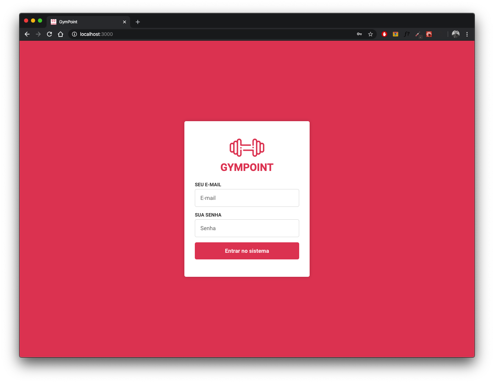
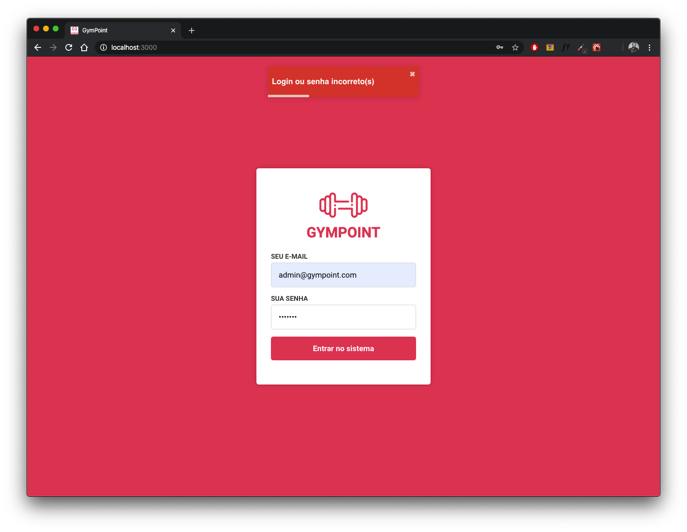
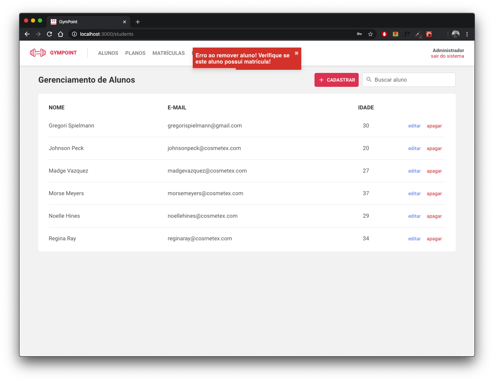
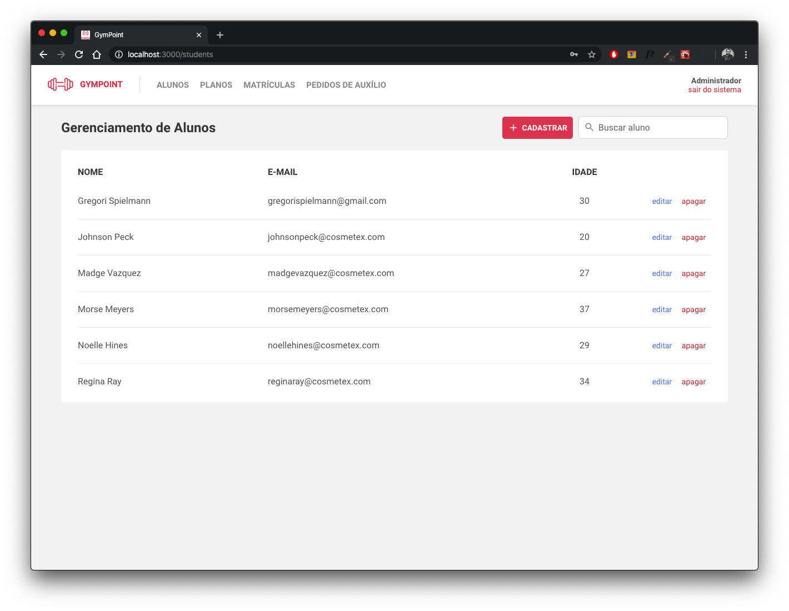
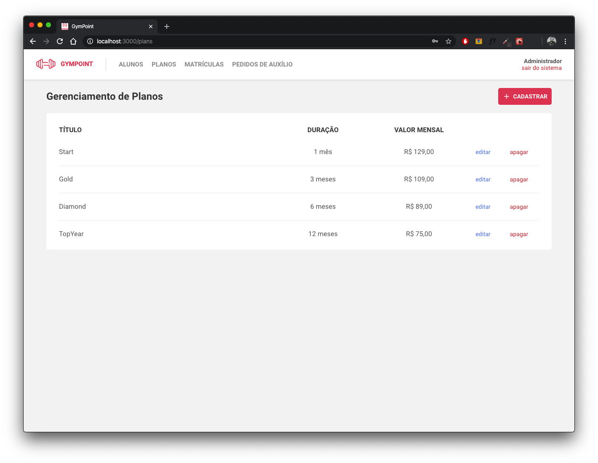
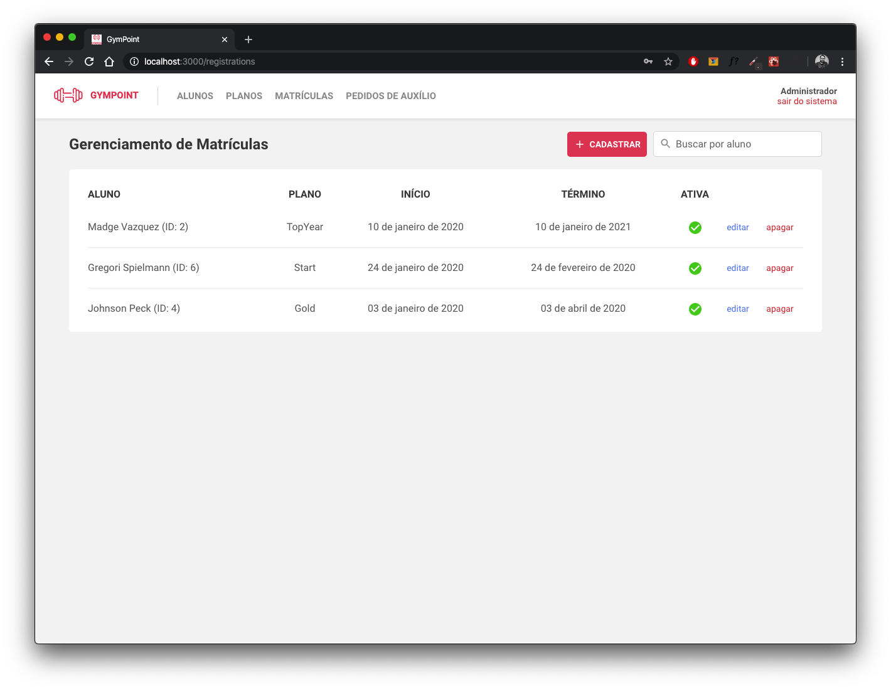
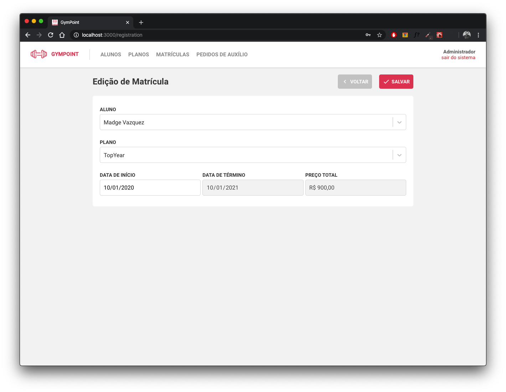
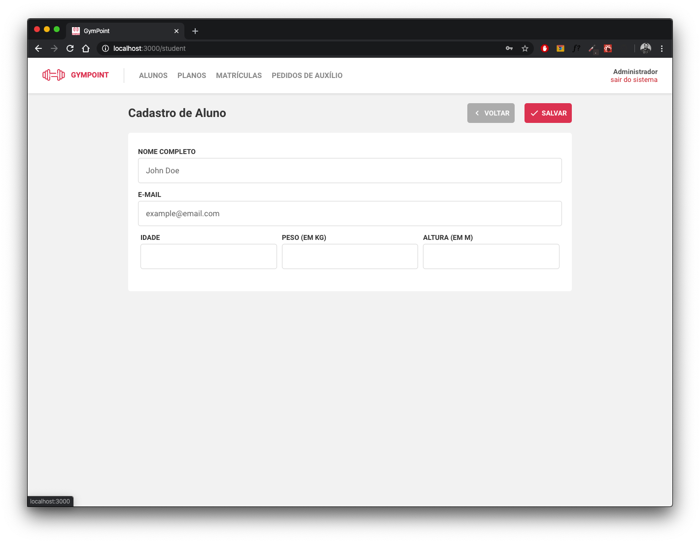
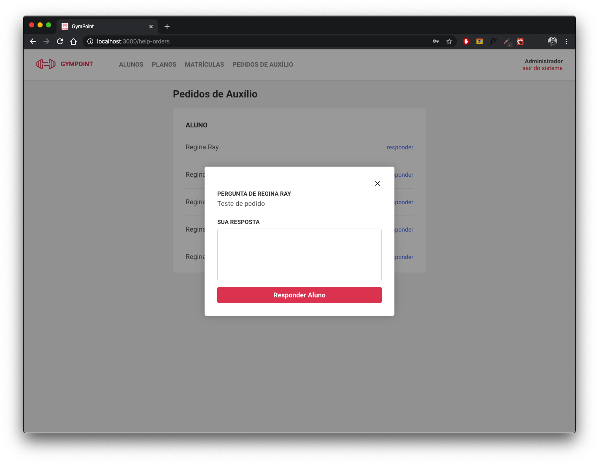
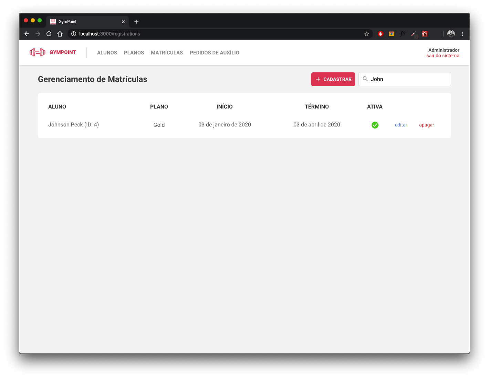

<!--<p align="center">
  <a href="" rel="noopener">
 </a>
</p>-->

<h3 align="center">GymPoint</h3>

<div align="center">

[]()
[](/LICENSE)

</div>

---

<p align="center"> This app is a full gym manager called GymPoint.
<br>
In this challenge was built some basic funcionalities to the gym manager and students.  The concept was a web app to control students, registrations, plans and help orders made by students. After we made a Mobile App (iOS Only) for the students do checkins at the gym and to publish help orders to the gym. 
    <br> 
</p>

## 📝 Table of Contents

- [About](#about)
- [Getting Started](#getting_started)
- [Usage](#usage)
- [Built Using](#built_using)
- [Authors](#authors)
- [TODO](#todo)

## 🧐 About <a name = "about"></a>

This project was made to be a full stack application including front-end, back-end and mobile and will be used to the [Rocketseat](https://github.com/rocketseat) Gostack 9 certification.

## 🏁 Getting Started <a name = "getting_started"></a>

These instructions will get you a copy of the project up and running on your local machine for development and testing purposes.

### Prerequisites

What things you need to install the software and how to install them.

- [Docker](https://www.docker.com/) - Container Platform
- [Yarn](https://yarnpkg.com/lang/en/) - Package Manager

### Installing

A step by step series of examples that tell you how to get a development env running.

### Cloning Repo

```
$ git clone https://github.com/gregorispielmann/gympoint-gostack.git
```

### Containers

First of all you need to create the containers (Postgres and redis), after install docker run the following command on your terminal

**IMPORTANT! Replace ???? by an available port**

```
$ docker run --name gympoint -e POSTGRES_PASSWORD=docker -p ????:5432 -d postgres:11
To create the container for Postgres DB

And then

$ docker run --name redisgympoint -p ????:6379 -d -t redis:alpine
To create the container to Redis

```

### Database

Before run backend you will need create the postgres database in our container. For this I highly recommend you to use [Postbird](https://github.com/Paxa/postbird). Then connect with your information (Postgres container) and create the database with name **'gympoint'** before you go to next step.

### Backend

After create and run all containers, create the postgres database you will be ready to initialize the backend.

Inside the backend folder run commands below.

```
$ yarn
To install all dependencies

$ yarn sequelize db:migrate
To run all migrations to database

$ yarn sequelize db:seed:all
To seed database with fake data
```

**ATTENTION! Before you start the development mode of backend, you will need edit the .envexample to your information and rename the file to .env**

After this you only need to run command below

```
$ yarn dev
This will start backend in dev mode

$ yarn queue
This will start the redis task queue
```

### Frontend (Web)

## Demo

<div style="display: flex;">












</div>

## How it runs?

After run backend.

```
$ yarn
To install all dependencies

$ yarn start
To run react application
```

### Mobile (:apple: iOS Only)

After run backend, inside the mobile folder run commands below.

```
$ yarn
To install all dependencies

$ cd ios && pod instal && cd ..
To install all cocoa pods dependencies

$ react-native run-ios
To run react application
```

## 🎈 Usage <a name="usage"></a>

### Web

Running the app you will signin with login info below

```
Login: admin@gympoint.com
Password: 123456
```

### Mobile

You will only need an ID from a student with an active registration.
In HelpOrders Page you need to use "Pull To Refresh" to see if there is any update in your help orders.

## ⛏️ Built Using <a name = "built_using"></a>

- [Docker](https://www.docker.com/) - Container Management
- [Redis](https://redis.io/) - Database
- [Postgres](https://www.postgressql.org/) - Database
- [Sequelize](https://sequelize.org/) - Node.js ORM
- [NodeJs](https://nodejs.org/en/) - Server Environment
- [Express](https://expressjs.com/) - Server Framework
- [ReactJs](https://reactjs.org/) - Web Framework
- [React Native](https://react-native.org/) - Mobile Framework
- [Styled Components](https://www.styled-components.com/) - CSS in Javascript library
- and others

## ✍️ Authors <a name = "authors"></a>

- [@rockeseat](https://rocketseat.com.br/bootcamp) - Idea & Initial template
- [@gregorispielmann](https://github.com/gregorispielmann) - Back-end, Front-end and Mobile App development

## TODO <a name="todo"></a>

- Android mobile app
- Aditional features to web and mobile
